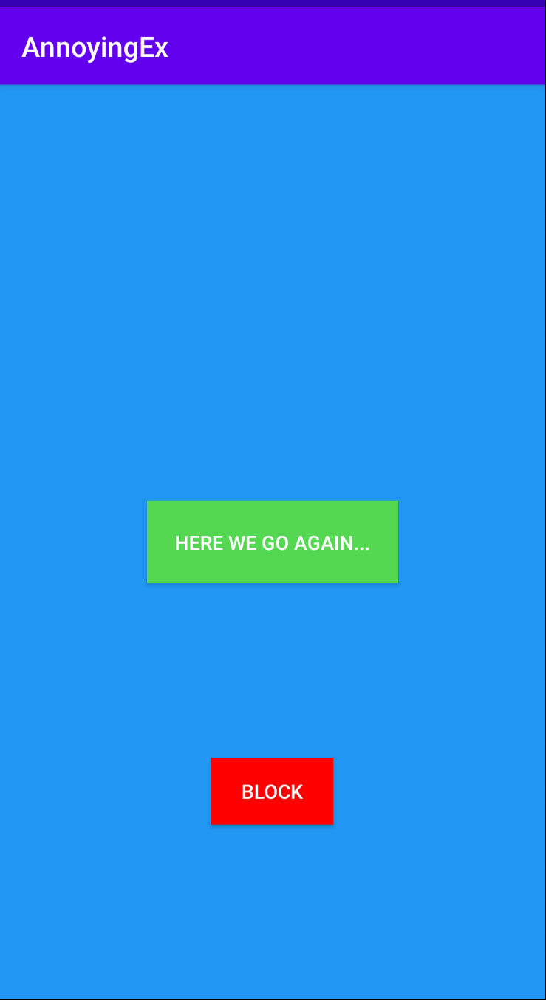
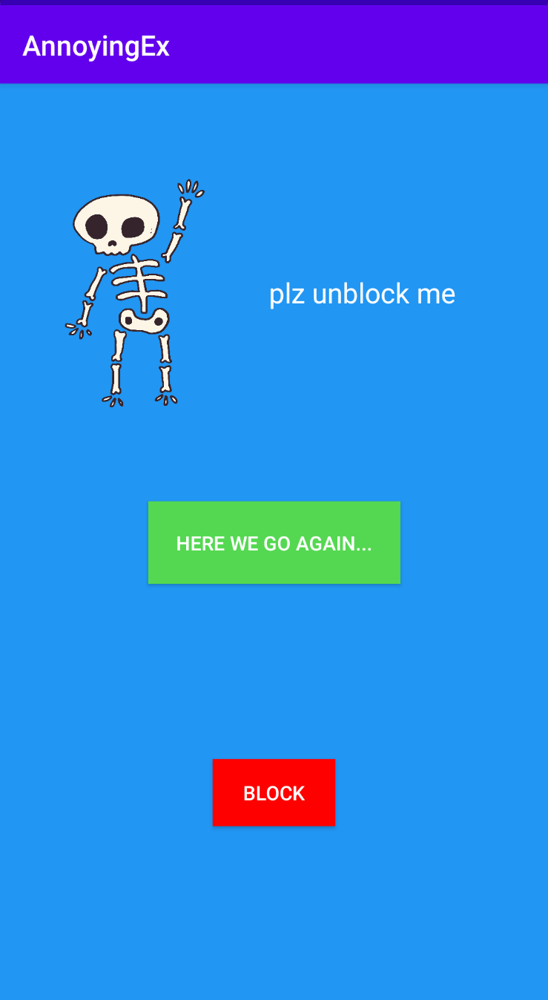

# AnnoyingEx
Here we go again... Just click on the button to pretend that you have an ex that spans you with messages

# Screenshots

# Installation
Download & Install Android Studio through Android's Official Download Page:

## Android Studio

On SDK Platforms tab, ensure that Android 10.0 (API Level 29) and Android 6.0 (API Level 23) are installed.

On SDK Tools tab, ensure the following are installed: Android SDK Build-Tools, Android SDK Platform Tools

## Clone Project
Mac users:

cd /Users/%USERNAME%/AndroidStudioProjects

git clone git@github.com:Erik-Huang/Dotify.git

git checkout hw2

Build Project on a physical device
Enable USB Debugging on the device.

Connect the computer and select the device from Android Studio.

Build the project.
